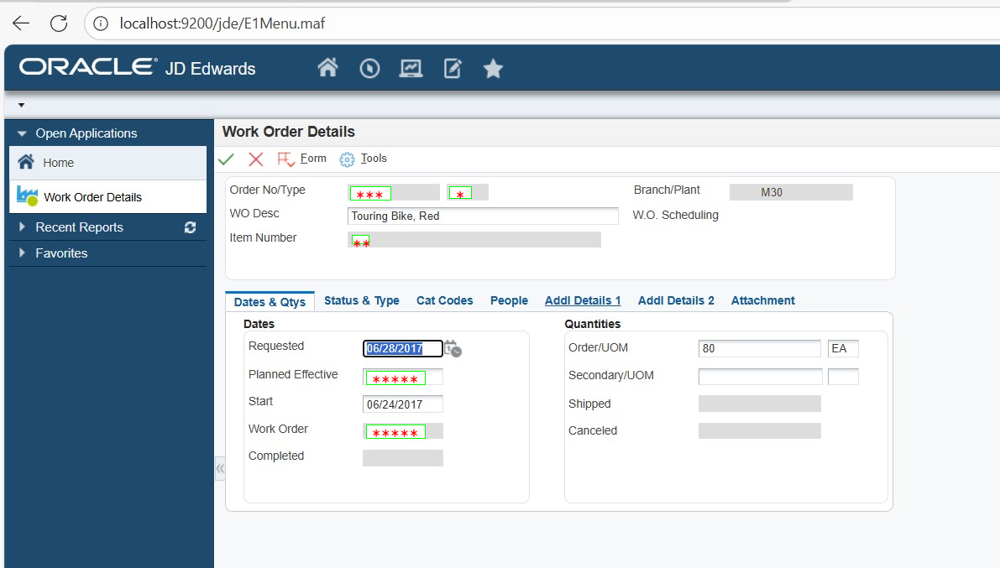

# UI Element–Aware Data Masking (PoC)

## Summary
This PoC demonstrates a **UI-semantic–aware data masking system** for UI screenshots. It detects UI elements using a **YOLO model**, extracts text using **EasyOCR + Tesseract**, and masks sensitive information **based on user intent**.

Supported masking:
- **Table Column** → masks all values under a column name
- **Text Field** → masks only the field value
- **Label Text** → masks text appearing after a label

> Detect UI → OCR → match user intent → mask only the required data

---

## How It Works (High Level)
1. YOLO detects UI elements (table column, text field, label)
2. OCR extracts text inside detected regions
3. User provides what to mask (column / field / label name)
4. Matching text regions are masked on the image

---

## How to Run

### Install Dependencies
```bash
pip install -r requirements.txt
```

---

### Run Demo
Download the model weights from the [drive](https://drive.google.com/file/d/1o37Dp5TIBTFebvGN-ssFlFpDNkwHouf-/view?usp=drive_link). And put it on the `assets/` folder. Then run the pipeline
```bash
python all_in_one.py \
  --model assets/best.pt \
  --image src/images/ss-1.jpeg \
  --headers "Order Number" "Supplier Description" "Order Date"
```
### Example Input
#### Example-1
For the input image below, if the user wants to mask the columns `Line Number`, `Sold To Name`, `Description 1`, and `Secondary Quality`, the output will be as shown.<br>

**Input Image:**


**Output Image (masked):**


---

#### Example-2
For the input image below, if the user wants to mask the fields `Order No/Type`, `Item Numer`, `Planned Effective`, and `Worker Order`, the output will be as shown.<br>
**Input Image:**

**Output Image (masked):**


---

## Tech Stack
- YOLO (UI element detection)
- EasyOCR + Tesseract (OCR)
- OpenCV
- Python

---

## Note
This is a **Proof of Concept**, focused on demonstrating intent-based, UI-aware masking rather than full production coverage.