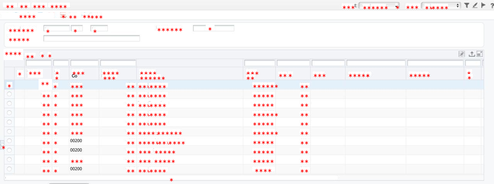
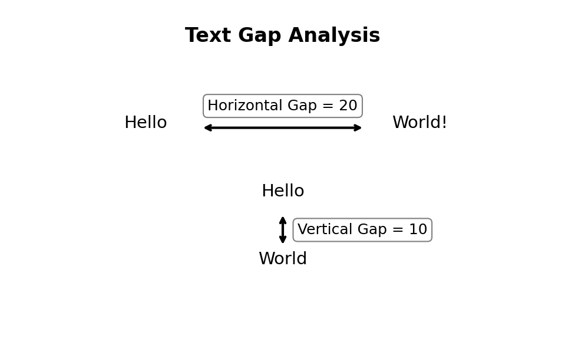
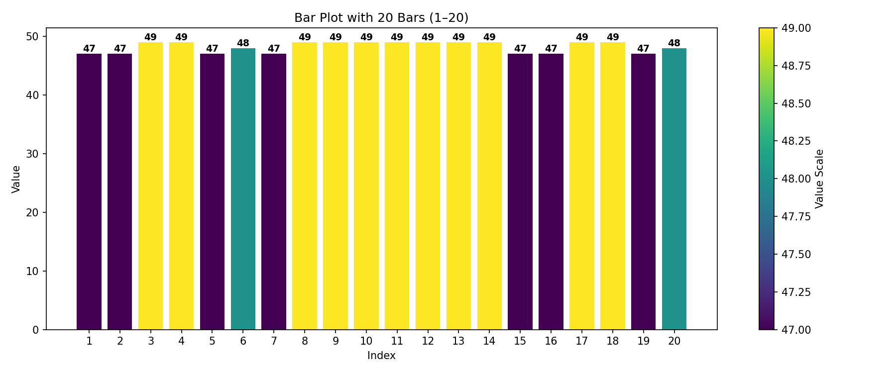
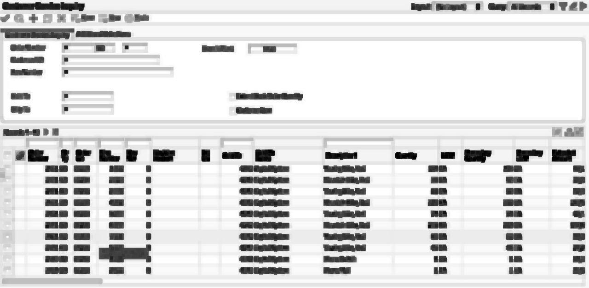
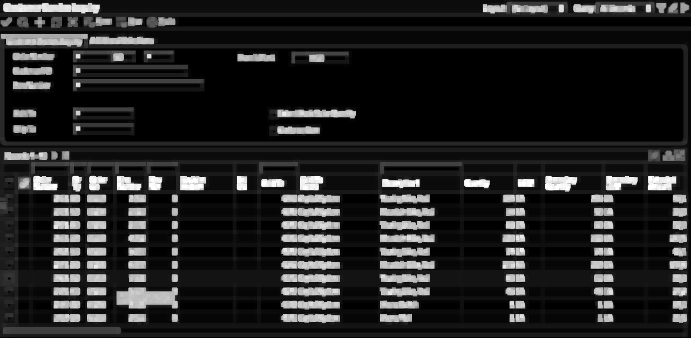
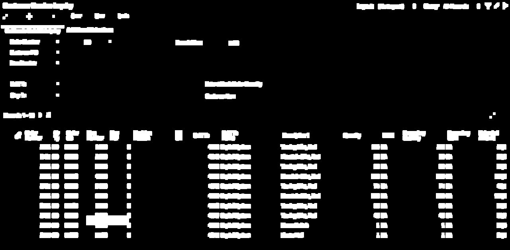
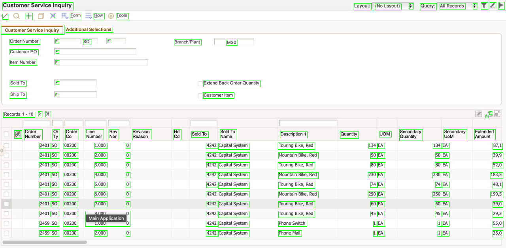
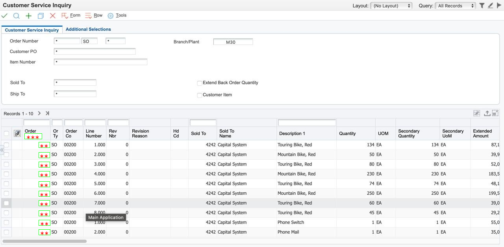
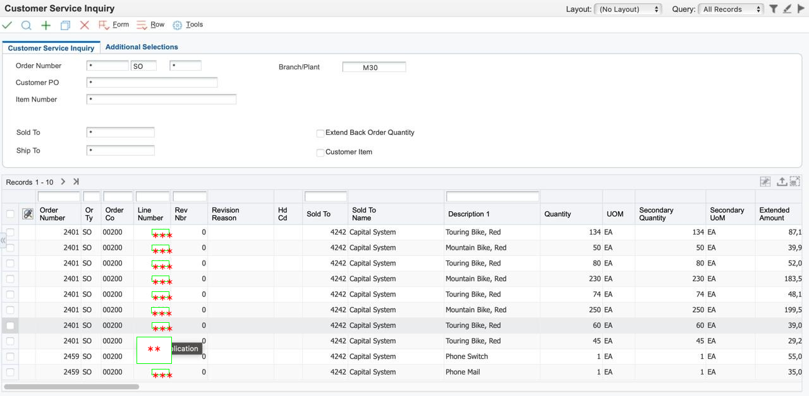

# February Progress Status
## 2026/02/17
### All Text Masking For Unknown Image
Sometimes system may fail to mask user input image because he may input unnown image or technical issue raise from pipeline. Then we will mask all text.<br>


---

## 2026/02/18
### Problem Statement

**Issues Identified**
- **Issue-1:** Table header lower border overlaps with table entries (masking text)
- **Issue-2:** OCR sometimes fails to detect table entries
- **Issue-3:** OCR detects each word separately instead of full header text (multiple text)

### Proposed Solution
1. Gap Analysis between Text
2. Apply **morphological operations** to:
- Separate table lines from text
- Extract accurate text bounding boxes
- Improve OCR reliability using structure-aware processing
---


## 2026/02/19
### Image Preprocessing & Line Separation (Gap Analysis)
Run on all images to experiment gap between texts (vertically and horizontally) and taking median
<p align="center">
  
  <br>
  <em>Figure 1: Text Gap Analysis</em>
</p>

<p align="center">
  
  <br>
  <em>Figure 2: Bar Plot Gap Analysis</em>
</p>

*But It fail because every image has different resolution so solution is not accurate*

---

## 2026/02/20

### Apply Morphological Operation
1. **Data Analysis**
   - Collect 10–20 problematic table images
   - Identify header, row, and line overlap regions

2. **Preprocessing Pipeline**
   - Convert image to grayscale
   - Apply adaptive thresholding
   - Test:
     - `THRESH_BINARY`
     - `THRESH_BINARY_INV`

3. **Morphological Line Detection**
   - Detect **horizontal lines**
     - Morphological opening with wide horizontal kernel
   - Detect **vertical lines**
     - Morphological opening with tall vertical kernel
   - Subtract detected lines from binary image

4. **Intermediate Validation**
   - Visually verify that text is no longer masked by borders

### Deliverables
- `cleaned_text_image.png`
- `horizontal_lines.png`
- `vertical_lines.png`

<p align="center">
  
  <br>
  <em>Figure 1: Erosion operation</em>
</p>

    Running all images for checking erosion dialation parameter and manually check images

---

## 2026/02/21
### Morphology-Based Bounding Box Detection

### 🎯 Goal
Generate accurate bounding boxes for headers and table entries independent of OCR word-level detection.

### Tasks
1. **Text Region Enhancement**
   - Apply dilation to:
     - Merge characters → words
     - Merge words → full headers / rows

2. **Connected Component Analysis**
   - Use contour detection or connected components
   - Filter boxes by:
     - Area threshold
     - Aspect ratio
     - Height consistency

3. **Header vs Row Separation**
   - Identify header blocks by:
     - Larger height
     - Top-most position
     - Width spanning multiple columns

4. **Bounding Box Refinement**
   - Merge overlapping or adjacent boxes (IoU-based)
   - Remove noise and tiny components

### Deliverables
- `bbox_overlay.png`
- Bounding box metadata (JSON):
```json
{
  "headers": [[x1, y1, x2, y2]],
  "rows": [[x1, y1, x2, y2], ...]
}

```
### Masking Region Detection

<p align="center">
  
  <br>
  <em>Figure 1: Refined Mask image</em>
</p>

**Now we need to convert binary image for getting mask region**
<p align="center">
  
  <br>
  <em>Figure 2: Refined Binary Masking image</em>
</p>

Let's draw boxes on image
<p align="center">
  
  <br>
  <em>Figure 3: Detected Boxes image</em>
</p>

### *We got satisfied output*

---


## 2026/02/22
### Full Pipeline Integration

**Issues**: If we look at boxes draw image (*ref: Figure 3: Detected Boxes image*), we a single boxe cover the two table column entries. Here `4242 Capital System` covered by single box. But it should be separate box since they are belong to different column. <br><br>
**Solution**: <br>
    We will separate them by our detection boxes (**YOLO**), just taking overlap region.
The following code 
```python
def rect_intersection(box1, box2):
    x1, y1, w1, h1 = np.array(box1, dtype=np.int32)
    x2, y2, w2, h2 = np.array(box2, dtype=np.int32)

    x_left   = max(x1, x2)
    y_top    = max(y1, y2)
    x_right  = min(x1 + w1, x2 + w2)
    y_bottom = min(y1 + h1, y2 + h2)

    if x_right <= x_left or y_bottom <= y_top:
        return None  # no overlap

    return (
        x_left,
        y_top,
        x_right - x_left,
        y_bottom - y_top
    )
```

Now Integrating full pipeline we can get more accuracy, now our pipeline can masking all table entries if searching algorihtm find the headers.

Old Issue:
<p align="center">
  
  <br>
  <em>Figure 1: Header name beneath line masked</em>
</p>

Current Picture(Solved):
<p align="center">
  
  <br>
  <em>Figure 1: Header name with accurate masked</em>
</p>